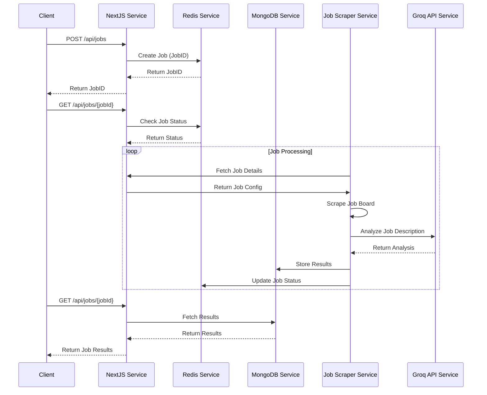
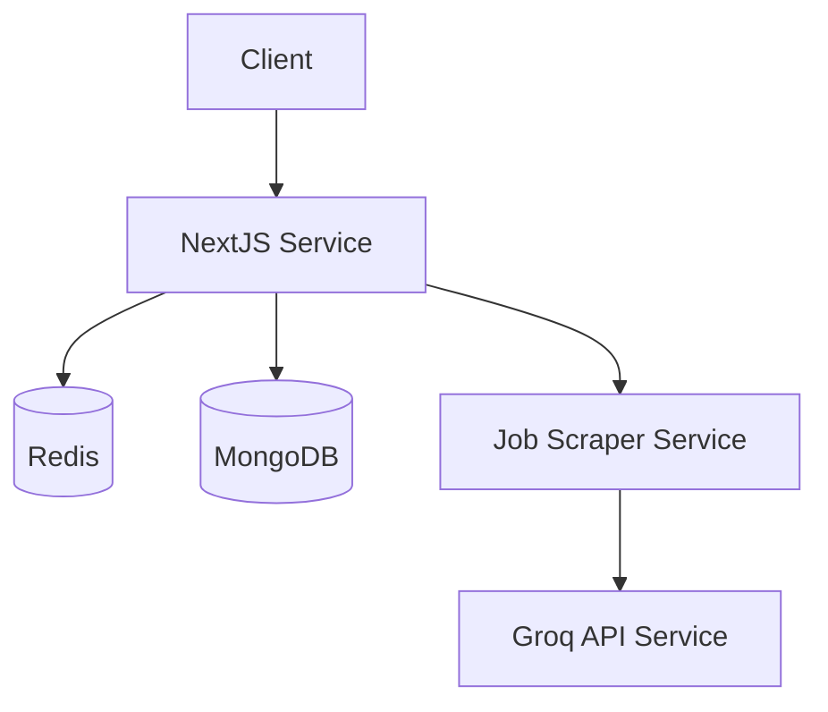

# 🛠 Internal Documentation – Job Board Scraper

This is the internal reference for the **Job Board Scraper** tool. It details the data flow, architecture, internal assumptions, and usage guidelines.

---

## 🔁 Flow Overview

1. **User selects a job board**:
   - Options include: `remoteok`, `weworkremotely`, `wellfound`, `web3.career`, `ycombinator`, etc.
   - This determines the scraper class/module to invoke.

2. **User specifies a Job Title**:
   - Example titles: `Frontend Engineer`, `DevOps`, `Fullstack Developer`, etc.
   - This sets the search query used by the scraper for that board.

3. **Scraping begins**:
   - The respective board module scrapes job listings.
   - Job information is extracted into a structured JSON format.

4. **Groq API is called**:
   - Each job's full description is sent to Groq.
   - Responses (individual and merged) are saved.

5. **Artifacts are saved**:
   - All results are stored under `/artifacts/<board>/<title>/`
   - Divided into:
     - `job_listings/`: Raw scraped jobs
     - `groq_responses/`: AI-analyzed results
     - `metadata/`: Summary of scraping session

---

## 🏗 Updated Microservice Architecture

The application is now structured as a microservice architecture with the following components:

### Services

1. **NextJS Frontend Service**
   - Handles the web interface
   - Communicates with Python API for job operations
   - Port: 3000

2. **Python API Service**
   - FastAPI-based backend service
   - Handles job creation, status tracking, and results
   - Integrates with job board scrapers
   - Port: 8000

3. **Redis Service**
   - Job queue management
   - Job status tracking
   - Caching layer
   - Port: 6379

4. **MongoDB Service**
   - Persistent storage for job results
   - Job metadata storage
   - Port: 27017

### Data Flow

1. **Job Creation**
   ```
   Client -> NextJS -> Python API -> Redis (Job Queue)
   ```

2. **Job Processing**
   ```
   Python API -> Job Board Scraper -> MongoDB (Results)
   Python API -> Redis (Status Updates)
   ```

3. **Job Status/Results**
   ```
   Client -> NextJS -> Python API -> Redis/MongoDB -> Client
   ```

### API Endpoints

#### Python API (FastAPI)

1. **Create Job**
   ```http
   POST /api/jobs
   Content-Type: application/json
   
   {
     "board": "remoteok",
     "title": "DevOps Engineer",
     "limit": 3
   }
   ```

2. **Get Job Status**
   ```http
   GET /api/jobs/{job_id}
   ```

3. **List All Jobs**
   ```http
   GET /api/jobs
   ```

### Job States

1. **pending**: Job created, waiting to be processed
2. **processing**: Job is being scraped and analyzed
3. **completed**: Job processing finished successfully
4. **failed**: Job processing encountered an error

### Error Handling

- All services implement proper error handling
- Failed jobs are logged with error details
- Retry mechanisms for transient failures
- Circuit breakers for external service calls

### Monitoring

- Service health checks
- Job processing metrics
- Error rate tracking
- Performance monitoring

### Security

- Environment variable configuration
- CORS protection
- API rate limiting
- Secure service communication

---

## 🧱 Architecture

```

src/
├── main.js               // Central entry point
├── utils/                // Utility functions (TBD)
└── job-boards/
├── base.js           // Abstract base class
├── remoteok/         // RemoteOK implementation
├── wellfound/
├── weworkremotely/
└── web3career/       // Placeholder for new boards

```

Each board has its own `board.js` that extends `BaseJobBoard` and implements methods:

- `searchJobs(title, limit)`
- `extractJobDetails()`

---

## 📄 Artifacts Directory Structure

```

artifacts/
└── weworkremotely/
└── fullstack-developer/
├── job\_listings/
│   └── job\_listings\_2025-05-06T08-45.json
├── groq\_responses/
│   ├── groq\_response\_<jobId>.json
│   └── all\_groq\_responses.json
└── metadata/
└── metadata\_2025-05-06T08-45.json

```

---

## ✅ Adding a New Job Board

To support a new board:

1. Create a new folder under `src/job-boards/<new_board_name>/`
2. Add `board.js` that extends the base class.
3. Implement the scraping logic:
   - `searchJobs(title, limit)`
   - `extractJobDetails(html)`
4. Register the board in `main.js`

---

## 🧪 Testing & Debugging

- Run with specific board & title:
```bash
npm start -- --board remoteok --title "DevOps Engineer" --limit 5
```

* Check artifacts for malformed entries or failed Groq responses.
* Use `console.log()` or add verbose logging in `main.js` for debugging.

---

## 🧠 Future Enhancements

* Add retry logic for Groq API failures
* Add scheduler or CLI prompts
* Support for saving as CSV or uploading to a database
* Web UI for selecting options

---

## 👥 Maintainers

* Main Dev: Akshat Sachan ([@SachanAkshat](https://twitter.com/SachanAkshat))
* Contributors: You 👋

---

## 📄 License

MIT — Internal use only unless explicitly published.

## 📡 API Documentation

### Job Scraping API

#### POST /api/jobs

Scrapes job listings from the specified job board.

**Request:**
```bash
curl -X POST http://localhost:3000/api/jobs \
  -H "Content-Type: application/json" \
  -d '{
    "board": "remoteok",
    "title": "DevOps Engineer",
    "limit": 3
  }'
```

**Response:**
```json
[
  {
    "jobId": "123456",
    "position": "Senior DevOps Engineer",
    "company": "Tech Corp",
    "location": "Remote",
    "salary": "$120k - $150k",
    "tags": ["DevOps", "AWS", "Kubernetes"],
    "posted": "2024-05-06T12:00:00Z",
    "views": 150,
    "applicants": 25,
    "applyPercentage": 16,
    "jobUrl": "https://remoteok.com/remote-jobs/123456",
    "description": "Full job description...",
    "parsedDescription": {
      "requirements": ["5+ years experience", "AWS certification"],
      "responsibilities": ["CI/CD pipeline management", "Infrastructure as Code"],
      "benefits": ["Health insurance", "401k", "Remote work"]
    }
  }
]
```

**Error Response:**
```json
{
  "error": "Failed to scrape jobs"
}
```

**Status Codes:**
- 200: Success
- 400: Invalid request (missing required fields)
- 500: Server error

**Request Parameters:**
- `board` (required): One of "remoteok", "weworkremotely", "wellfound"
- `title` (required): Job title to search for
- `limit` (optional): Number of results to return (default: 3, max: 10)

### Job Queue API

#### Create Job
```http
POST /api/jobs
Content-Type: application/json

{
  "board": "remoteok",
  "title": "DevOps Engineer",
  "limit": 3
}
```

Response:
```json
{
  "jobId": "550e8400-e29b-41d4-a716-446655440000"
}
```

#### Get Job Status
```http
GET /api/jobs?jobId=550e8400-e29b-41d4-a716-446655440000
```

Response:
```json
{
  "jobId": "550e8400-e29b-41d4-a716-446655440000",
  "status": "completed",
  "board": "remoteok",
  "title": "DevOps Engineer",
  "limit": 3,
  "result": [
    {
      "jobId": "123",
      "position": "Senior DevOps Engineer",
      "company": "Example Corp",
      "location": "Remote",
      "salary": "$120k - $150k",
      "description": {
        "requirements": ["5+ years experience", "AWS", "Kubernetes"],
        "responsibilities": ["Infrastructure management", "CI/CD"],
        "benefits": ["Health insurance", "401k"]
      }
    }
  ],
  "createdAt": "2024-03-14T12:00:00Z",
  "updatedAt": "2024-03-14T12:01:00Z"
}
```

#### List All Jobs
```http
GET /api/jobs
```

Response:
```json
[
  {
    "jobId": "550e8400-e29b-41d4-a716-446655440000",
    "status": "completed",
    "board": "remoteok",
    "title": "DevOps Engineer",
    "limit": 3,
    "createdAt": "2024-03-14T12:00:00Z",
    "updatedAt": "2024-03-14T12:01:00Z"
  }
]
```

### Status Codes
- 200: Success
- 400: Invalid request (missing required fields)
- 404: Job not found
- 500: Server error

### Request Parameters
- `board` (required): The job board to scrape (e.g., "remoteok")
- `title` (required): The job title to search for
- `limit` (optional): Maximum number of jobs to return (default: 10)

### Job Status Values
- `pending`: Job is created and waiting to be processed
- `processing`: Job is currently being processed
- `completed`: Job has been successfully processed
- `failed`: Job processing failed

## 📊 System Architecture Diagrams

### Sequence Diagram


### Architecture Diagram


## 🐳 Docker Configuration

The application is containerized using Docker and orchestrated with Docker Compose. The following services are defined:

1. **NextJS Service**: Frontend and API layer
2. **Redis Service**: Job queue and caching
3. **MongoDB Service**: Data persistence
4. **Job Scraper Service**: Background job processing

### Docker Compose Configuration
```yaml
version: '3.8'

services:
  nextjs:
    build:
      context: .
      dockerfile: Dockerfile.nextjs
    ports:
      - "3000:3000"
    environment:
      - REDIS_URL=redis://redis:6379
      - MONGODB_URI=mongodb://mongodb:27017/jobboard
      - GROQ_API_KEY=${GROQ_API_KEY}
    depends_on:
      - redis
      - mongodb

  redis:
    image: redis:alpine
    ports:
      - "6379:6379"
    volumes:
      - redis_data:/data

  mongodb:
    image: mongo:latest
    ports:
      - "27017:27017"
    volumes:
      - mongodb_data:/data/db
    environment:
      - MONGO_INITDB_ROOT_USERNAME=${MONGO_ROOT_USERNAME}
      - MONGO_INITDB_ROOT_PASSWORD=${MONGO_ROOT_PASSWORD}

  scraper:
    build:
      context: .
      dockerfile: Dockerfile.scraper
    environment:
      - REDIS_URL=redis://redis:6379
      - MONGODB_URI=mongodb://mongodb:27017/jobboard
      - GROQ_API_KEY=${GROQ_API_KEY}
    depends_on:
      - redis
      - mongodb

volumes:
  redis_data:
  mongodb_data:
```

### Dockerfile.nextjs
```dockerfile
FROM node:18-alpine

WORKDIR /app

COPY package*.json ./
RUN npm install

COPY . .

RUN npm run build

EXPOSE 3000

CMD ["npm", "start"]
```

### Dockerfile.scraper
```dockerfile
FROM node:18-alpine

WORKDIR /app

COPY package*.json ./
RUN npm install

COPY . .

CMD ["node", "src/scraper.js"]
```

### Environment Variables (.env)
```env
GROQ_API_KEY=your_groq_api_key
MONGO_ROOT_USERNAME=admin
MONGO_ROOT_PASSWORD=secure_password
```

### Running the Application
```bash
# Build and start all services
docker-compose up --build

# View logs
docker-compose logs -f

# Stop all services
docker-compose down
```
